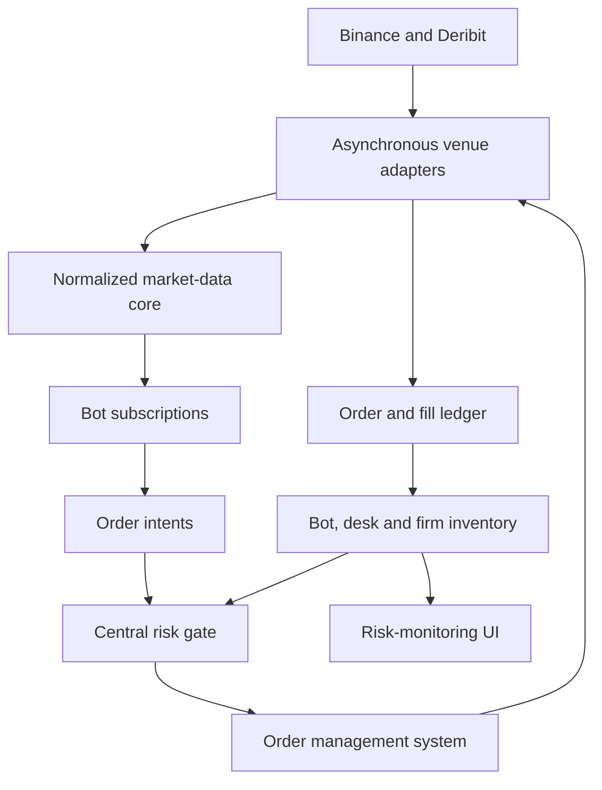
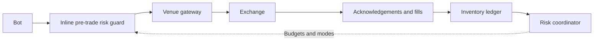

# AEGIS Architecture

AEGIS (Asynchronous Exchange Gateway and Inventory System) is an asynchronous, multi-venue trading and risk engine. It receives market data from exchange adapters, normalizes that data, distributes it to subscribed bots, and centrally manages orders, inventory and risk.

## System Architecture



Exchange adapters are responsible only for communication with exchanges and translation between exchange-native messages and AEGIS data types.

Bots never communicate with exchanges directly. Every order must pass through the central risk gate and order management system.

## Organizational Hierarchy

AEGIS represents the trading activity of an entire firm.

- **Firm**
  - Contains one or more desks.
  - Maintains aggregate firm-wide exposure, inventory and P&L.
  - Assigns risk budgets and trading modes to desks.

  - **Desk**
    - Belongs to exactly one firm.
    - Contains one or more bots.
    - Maintains desk-level exposure, inventory and P&L.
    - Assigns risk budgets to its bots.

    - **Bot**
      - Belongs to exactly one desk.
      - Runs one configured strategy instance.
      - May subscribe to multiple venues and instruments.
      - May execute and hedge across multiple venues.
      - Generates order requests but cannot bypass pre-trade risk controls.

Example:

- **AEGIS Trading Firm**
  - **Digital Assets Market-Making Desk**
    - BTC Multi-Venue Market Maker
    - ETH Multi-Venue Market Maker
  - **Cross-Asset Desk**
    - BTC Futures Basis Bot

Every order and fill is attributed to a bot. Bot-level activity is aggregated through the organizational hierarchy:

```text
Bot inventory → Desk inventory → Firm inventory
```

A bot cannot choose or modify its own desk identity. The engine derives its desk and firm from the registered `BotId`.

## Strategy, Bot and Venue Route

Strategies, bots, venue adapters and execution routes are separate concepts.

| Concept | Purpose | Example |
|---|---|---|
| Strategy | Reusable trading algorithm | `InventoryAwareMarketMaker` |
| Bot | Running, configured strategy instance | `BTC Multi-Venue MM` |
| Venue adapter | Shared exchange connectivity | `BinanceAdapter` |
| Execution route | A bot’s permitted route to a venue, account and instrument | Binance BTC perpetual |
| Subscription | Market data consumed by a bot | Binance and Deribit BTC books |

### Strategy

A strategy defines reusable decision logic. It is not tied to a particular desk, venue or trading account.

```cpp
class Strategy {
public:
    virtual ~Strategy() = default;

    virtual void on_market_event(
        const MarketEvent& event,
        BotContext& context
    ) = 0;

    virtual void on_order_event(
        const OrderEvent& event,
        BotContext& context
    ) = 0;
};
```

For example, `InventoryAwareMarketMaker` can:

- Calculate fair value using several exchanges.
- Quote on one or several exchanges.
- Hedge inventory on a different exchange.
- Manage an aggregate inventory target across all permitted venues.

### Bot

A bot is a running instance of a strategy with concrete configuration and organizational identity.

```cpp
struct Bot {
    BotId id;
    DeskId desk_id;

    BotConfiguration configuration;
    std::unique_ptr<Strategy> strategy;
};
```

Example configuration:

```text
Bot: BTC Multi-Venue MM
Desk: Digital Assets Market-Making

Strategy:
  InventoryAwareMarketMaker

Market-data subscriptions:
  - Binance BTC perpetual order book
  - Binance BTC perpetual trades
  - Deribit BTC perpetual order book
  - Deribit BTC perpetual trades

Execution routes:
  - Binance BTC perpetual
  - Deribit BTC perpetual

Inventory target:
  0 BTC across all routes
```

The bot can use Binance and Deribit simultaneously to calculate a consolidated fair value:

$$
\text{fair value}
= w_B P_{\mathrm{Binance}}
+ w_D P_{\mathrm{Deribit}}
+ \text{order-flow adjustment}
- \text{inventory adjustment}
$$

It can then independently determine where to quote or hedge.

### Venue adapters

Venue adapters are shared infrastructure. They do not belong to individual bots.

A single `BinanceAdapter` can serve every desk and bot authorized to use Binance. It manages:

- Public market-data connections
- Private order and fill connections
- Exchange authentication
- Native message parsing
- Symbol mapping
- Order encoding
- Connection recovery

Bots consume normalized data and submit normalized order requests. They never access adapters directly.

### Execution routes

An execution route grants a bot permission to trade a specific instrument through a particular venue and account.

```cpp
struct ExecutionRoute {
    Venue venue;
    AccountId account;
    InstrumentId instrument;
};
```

The engine rejects any order request for which the bot has no configured execution route.

This allows a bot to subscribe broadly while retaining narrow execution permissions. For example, a bot may consume Binance data as a pricing signal while being permitted to trade only on Deribit.

## Latency-Sensitive Order Path

The logical risk authority is centralized, but order requests must not travel through a slow general-purpose event bus or remote risk service.

AEGIS separates the system into a control plane and a latency-sensitive data plane.

### Control plane

The control plane handles:

- Firm-wide risk aggregation
- Desk and bot risk-budget allocation
- Inventory reporting
- Risk-mode changes
- Configuration
- Monitoring and the graphical UI

These operations may run asynchronously because they are not part of the immediate order-submission path.

### Data plane

The data plane handles:

- Market-data processing
- Strategy callbacks
- Pre-trade risk checks
- Exposure reservation
- Order encoding
- Exchange transmission



The critical order path is:

```text
Strategy decision
→ submit OrderRequest
→ check and reserve local risk capacity
→ encode exchange-native order
→ asynchronous socket write
```

It must not require:

- JSON serialization between internal components
- Heap allocation for every order
- A general-purpose message queue
- A database request
- A UI update
- A network call to a separate risk service
- A thread hop merely to approve the order

The bot submits a small, fixed-size `OrderRequest`:

```cpp
struct OrderRequest {
    InstrumentId instrument;
    Venue venue;
    Side side;
    OrderType type;
    PriceTicks price;
    QuantityLots quantity;
};
```

Submission performs an immediate risk check:

```cpp
SubmitResult Engine::submit_order(
    BotId bot_id,
    const OrderRequest& request
) {
    auto approval = pre_trade_risk_.check_and_reserve(
        bot_id,
        request
    );

    if (!approval) {
        return SubmitResult::rejected(approval.error());
    }

    return order_manager_.submit(
        request,
        approval.reservation()
    );
}
```

The risk check and exposure reservation form one atomic operation. This prevents two concurrent requests from consuming the same available capacity.

Order acknowledgements, rejections and fills are processed asynchronously after submission.

## Hierarchical Risk Budgets

Firm-wide risk does not require recalculating the entire firm portfolio synchronously for every order.

The central risk coordinator can allocate capacity hierarchically:

```text
Firm risk budget
├── Digital Assets Market-Making Desk
│   ├── BTC Multi-Venue MM Bot
│   └── ETH Multi-Venue MM Bot
└── Cross-Asset Desk
    └── BTC Futures Basis Bot
```

Each bot receives a bounded allocation derived from its desk’s allocation. The inline pre-trade risk guard checks the order against locally available capacity.

The central coordinator continuously aggregates:

- Confirmed positions
- Reserved open-order exposure
- Gross and net exposure
- Realized and unrealized P&L
- Venue and account exposure
- Current risk modes

It may reduce allocations or transition a firm, desk or bot between:

```cpp
enum class RiskMode {
    Normal,
    ReduceOnly,
    Halted
};
```

The latest mode and risk budget are cached directly in the pre-trade risk guard, making enforcement fast.

## Relationship to Production Trading Systems

The exact architecture used by Citadel Securities, Optiver and similar firms is proprietary. Public information does not establish their precise order-routing or internal risk implementation.

What is publicly established is:

- Citadel Securities develops production-grade, low-latency crypto trading systems using modern C++ and uses FPGA systems to accelerate trading-system operations. [Citadel Securities crypto C++ role](https://www.citadelsecurities.com/careers/details/crypto-quantitative-developer/) and [FPGA engineering role](https://www.citadelsecurities.com/careers/details/fpga-engineer-intern-us/)
- Optiver has publicly described exchange-feed infrastructure that forwards messages to multiple automated traders, including work that reduced feed latency by 25–50%. [Optiver feed-infrastructure project](https://optiver.com/working-at-optiver/technology/tech-intern-projects-at-optiver-amsterdam/)
- Jane Street publicly discusses single-core packet-processing systems handling millions of messages per second and emphasizes deterministic latency and avoiding message backlogs. [Jane Street performance engineering](https://www.janestreet.com/performance-engineering/)
- In regulated US securities markets, SEC Rule 15c3-5 requires automated pre-trade controls and explicitly applies those controls to market-maker quotes. [SEC market-access risk-control guidance](https://www.sec.gov/rules-regulations/staff-guidance/trading-markets-frequently-asked-questions/divisionsmarketregfaq-0)

The SEC rule does not directly govern this project’s Binance and Deribit integrations. It nevertheless demonstrates an important industry principle: professional trading firms do not remove pre-trade controls to reduce latency. They engineer those controls so that they remain on the critical path without becoming a significant bottleneck.

AEGIS follows that principle through centralized risk authority, hierarchical risk allocation and local inline enforcement.