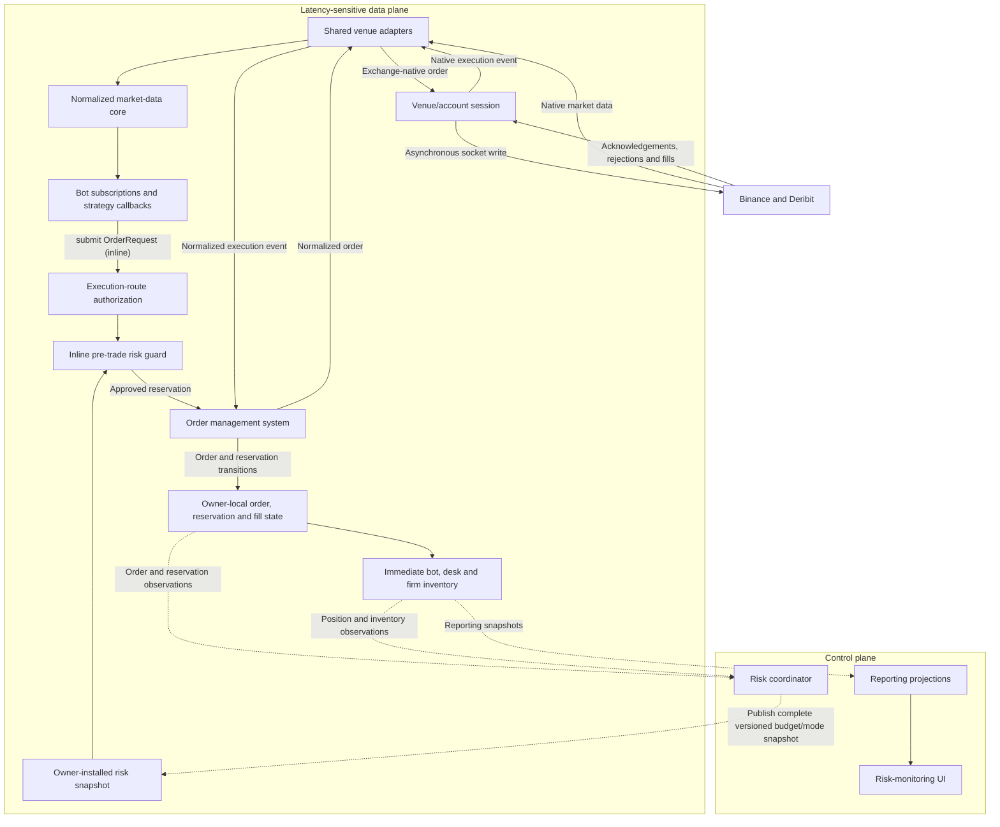
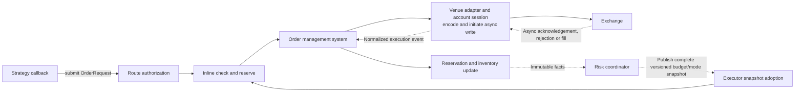

# AEGIS Architecture

> **Purpose:** Describe AEGIS's accepted system boundaries, ownership model, critical order path,
> and the proposed or open design areas that later implementation milestones must resolve.

AEGIS (Asynchronous Exchange Gateway and Inventory System) is an asynchronous, multi-venue trading and risk engine. It receives market data from exchange adapters, normalizes that data, distributes it to subscribed bots, and centrally manages orders, inventory and risk.

## Document Status and Map

The architecture documentation uses these status labels:

| Status | Meaning |
|---|---|
| **Accepted** | A project decision that implementations must preserve until it is superseded. |
| **Proposed** | A candidate design that has not yet been accepted. |
| **Illustrative** | An explanatory example, not a final C++ API or wire format. |
| **Open** | A decision that has deliberately not been made yet. |

Unless stated otherwise, architectural rules in this document are **Accepted**. C++ snippets are **Illustrative**.

Supporting documents provide more detail without turning conceptual diagrams into final APIs:

- [Components and ownership](architecture/components.md)
- [Runtime flows](architecture/runtime-flows.md)
- [Provisional repository layout](architecture/repository-layout.md)
- [ADR-0001: Serialized data-plane execution and state ownership](decisions/0001-serialized-data-plane-execution.md)
- [ADR-0002: Initial delivery toolchain](decisions/0002-delivery-toolchain.md)
- [ADR-0003: Dedicated Deribit testnet account](decisions/0003-dedicated-testnet-account.md)
- [ADR-0004: Deterministic domain value contracts](decisions/0004-domain-value-contracts.md)
- [ADR-0005: Immutable configuration provenance](decisions/0005-immutable-configuration-provenance.md)
- [M0 reference scenario](reference-scenario.md)
- [Initial correctness and performance budgets](quality-budgets.md)
- [Proposed implementation roadmap](implementation-roadmap.md)

## System Architecture

The diagram groups components by latency responsibility. Solid arrows show the immediate data and
order path; dotted arrows show asynchronous observations or complete snapshot publication.



Exchange adapters are responsible only for communication with exchanges and translation between exchange-native messages and AEGIS data types.

Bots never communicate with exchanges directly. Every order must pass inline through route authorization, the pre-trade risk guard and then the order management system.

## Organizational Hierarchy

This hierarchy defines immutable attribution and future aggregation boundaries. It does not imply
that firms, desks or bots are mutable runtime containers, nor does it create authority between peer
firm roots.

One AEGIS startup configuration represents one or more independently attributed firms. Each firm is
an organizational root, allowing subsidiaries to remain distinct without introducing a parent
`Company` entity or cross-firm aggregation in M1.

- **Firm**
  - Contains one or more desks.
  - Maintains aggregate firm-wide exposure, inventory and P&L.
  - Assigns risk budgets and trading modes to desks.

  - **Desk**
    - Belongs to exactly one firm.
    - Contains one or more bots.
    - Maintains desk-level exposure, inventory and P&L.
    - Assigns risk budgets to its bots.

    - **Bot**
      - Belongs to exactly one desk.
      - Runs one configured strategy instance.
      - May subscribe to multiple venues and instruments.
      - May execute and hedge across multiple venues.
      - Generates order requests but cannot bypass pre-trade risk controls.

Example:

- **AEGIS Trading Firm**
  - **Digital Assets Market-Making Desk**
    - BTC Multi-Venue Market Maker
    - ETH Multi-Venue Market Maker
  - **Cross-Asset Desk**
    - BTC Futures Basis Bot

Every order and fill is attributed to a bot. Bot-level activity is aggregated only through that
bot's organizational hierarchy:

```text
Bot inventory → Desk inventory → Firm inventory
```

A bot cannot choose or modify its own desk identity. The engine derives its desk and firm from the registered `BotId`.

## Strategy, Bot and Venue Route

Strategies, bots, venue adapters and execution routes are separate concepts.

| Concept | Purpose | Example |
|---|---|---|
| Strategy | Reusable trading algorithm | `InventoryAwareMarketMaker` |
| Bot | Running, configured strategy instance | `BTC Multi-Venue MM` |
| Venue adapter | Shared exchange connectivity | `BinanceAdapter` |
| Execution route | A bot’s permitted route to a venue, account and instrument | Binance BTC perpetual |
| Subscription | Market data consumed by a bot | Binance and Deribit BTC books |

### Strategy

A strategy defines reusable decision logic. It is not tied to a particular desk, venue or trading account.

```cpp
class Strategy {
public:
    virtual ~Strategy() = default;

    virtual void on_market_event(
        const MarketEvent& event,
        BotContext& context
    ) = 0;

    virtual void on_order_event(
        const OrderEvent& event,
        BotContext& context
    ) = 0;
};
```

For example, `InventoryAwareMarketMaker` can:

- Calculate fair value using several exchanges.
- Quote on one or several exchanges.
- Hedge inventory on a different exchange.
- Manage an aggregate inventory target across all permitted venues.

### Bot

A bot is a running instance of a strategy with concrete configuration and organizational identity.

```cpp
struct Bot {
    BotId id;
    BotConfiguration configuration;
    std::unique_ptr<Strategy> strategy;
};
```

Example configuration:

```text
Bot: BTC Multi-Venue MM
Desk: Digital Assets Market-Making

Strategy:
  InventoryAwareMarketMaker

Market-data subscriptions:
  - Binance BTC perpetual order book
  - Binance BTC perpetual trades
  - Deribit BTC perpetual order book
  - Deribit BTC perpetual trades

Execution routes:
  - Binance BTC perpetual
  - Deribit BTC perpetual

Inventory target:
  0 BTC across all routes
```

The bot can use Binance and Deribit simultaneously to calculate a consolidated fair value:

$$
\text{fair value}
= w_B P_{\mathrm{Binance}}
+ w_D P_{\mathrm{Deribit}}
+ \text{order-flow adjustment}
- \text{inventory adjustment}
$$

It can then independently determine where to quote or hedge.

### Venue adapters

Venue adapters are shared infrastructure. They do not belong to individual bots.

A single `BinanceAdapter` can serve every desk and bot authorized to use Binance. It manages:

- Public market-data connections
- Private order and fill connections
- Exchange authentication
- Native message parsing
- Symbol mapping
- Order encoding
- Connection recovery

Bots consume normalized data and submit normalized order requests. They never access adapters directly.

### Execution routes

An execution route grants a bot permission to trade a specific instrument through a particular venue and account.

```cpp
struct ExecutionRoute {
    Venue venue;
    LogicalAccountId account;
    InstrumentId instrument;
};
```

The logical account is a stable configuration alias. It is not interchangeable with a venue-native
account identifier reported during authenticated reconciliation.

The engine rejects any order request for which the bot has no configured execution route.

This allows a bot to subscribe broadly while retaining narrow execution permissions. For example, a bot may consume Binance data as a pricing signal while being permitted to trade only on Deribit.

## Latency-Sensitive Order Path

The logical risk authority is centralized, but order requests must not travel through a slow general-purpose event bus or remote risk service.

AEGIS separates the system into a control plane and a latency-sensitive data plane.

### Control plane

The control plane handles:

- Firm-wide risk aggregation
- Desk and bot risk-budget allocation
- Inventory reporting
- Risk-mode changes
- Configuration
- Monitoring and the graphical UI

These operations may run asynchronously because they are not part of the immediate order-submission path.

The data plane owns the immediate confirmed positions, reservations and order-derived exposure required by the next pre-trade check. It exports immutable facts and snapshots to the control plane for aggregation, reporting and policy calculation; the control plane does not reach into mutable data-plane state.

### Data plane

The data plane handles:

- Market-data processing
- Strategy callbacks
- Pre-trade risk checks
- Exposure reservation
- Order-state reconciliation
- Immediate position and inventory updates
- Order encoding
- Exchange transmission

For the first implementation, one dedicated thread and serialized executor owns all mutable data-plane state and runs every data-plane handler to completion. This is an accepted v1 ownership decision, not a claim that the engine will always remain single-threaded. See [ADR-0001](decisions/0001-serialized-data-plane-execution.md).

#### In-memory order books

**Status:** In-memory single-owner working state is **Accepted**. The synchronization behavior below is **Proposed**; exact representation, retained depth and historical retention remain **Open**.

For every subscribed venue/instrument that requires order-book data, the normalized market-data core maintains the current working book in memory. A venue adapter normally supplies an initial snapshot followed by ordered incremental updates.

On one serialized executor turn, AEGIS:

1. validates the source session/generation, sequence, instrument-metadata revision and any venue checksum;
2. applies the complete update to the owner-local book;
3. transitions the book's readiness state; and
4. dispatches a normalized event or read-only view only after the update is complete.

A strategy therefore observes either the coherent state before an update or the coherent state after it, never a half-applied book. If a sequence gap, checksum failure, incompatible metadata change or excessive staleness makes the book unreliable, AEGIS marks it non-ready and obtains a fresh snapshot before treating it as tradable again.

The latency-sensitive data plane needs the current working book, not necessarily its entire history. Historical raw messages, normalized events or book snapshots may be copied asynchronously to off-path storage for replay and research. The required depth—top of book, a fixed number of levels or the full venue book—and the long-term retention policy should follow concrete strategy and recovery requirements.

The following diagram returns to the end-to-end order path and shows where asynchronous venue events
and control-plane snapshots re-enter the serialized data-plane owner.



The critical order path is:

```text
Strategy callback
→ submit OrderRequest
→ authorize the configured execution route
→ check and reserve local risk capacity inline
→ register the order with the order management system
→ encode exchange-native order
→ initiate asynchronous socket write
```

It must not require:

- JSON serialization between internal components
- Heap allocation for every order
- A general-purpose message queue
- A database request
- A UI update
- A network call to a separate risk service
- A thread hop merely to approve the order

An asynchronous stream may eventually require a bounded, session-local write sequencer when another write is already in progress. That mechanism would sit after OMS admission, would not be a general-purpose event bus, and would not move the risk decision to another execution context. Its capacity and admission-failure policy remain **Open**.

The bot submits a small, fixed-size `OrderRequest`:

```cpp
struct OrderRequest {
    InstrumentId instrument;
    Venue venue;
    Side side;
    OrderType type;
    PriceTicks price;
    QuantityLots quantity;
};
```

Submission performs route authorization followed by an immediate risk check. The route context and function names below are illustrative; the final route-selection API remains open:

```cpp
SubmitResult Engine::submit_order(
    BotId bot_id,
    const OrderRequest& request
) {
    auto route = execution_routes_.authorize(bot_id, request);

    if (!route) {
        return SubmitResult::rejected(route.error());
    }

    auto approval = pre_trade_risk_.check_and_reserve(
        bot_id,
        request,
        route.value()
    );

    if (!approval) {
        return SubmitResult::rejected(approval.error());
    }

    return order_manager_.submit(
        bot_id,
        request,
        route.value(),
        approval.reservation()
    );
}
```

The risk check and exposure reservation form one atomic operation. The v1 data-plane executor runs this operation to completion, so another submission cannot interleave and consume the same available capacity.

Order acknowledgements, rejections and fills are processed asynchronously on later turns of the same executor. They reconcile OMS state before reservations and immediate inventory are updated and before the originating bot receives its order event. The detailed OMS states and reservation transitions remain **Open**.

## Hierarchical Risk Budgets

Firm-wide risk does not require recalculating the entire firm portfolio synchronously for every order.

The central risk coordinator can allocate capacity hierarchically:

```text
Firm risk budget
├── Digital Assets Market-Making Desk
│   ├── BTC Multi-Venue MM Bot
│   └── ETH Multi-Venue MM Bot
└── Cross-Asset Desk
    └── BTC Futures Basis Bot
```

Each bot receives a bounded allocation derived from its desk’s allocation. The inline pre-trade risk guard checks the order against locally available capacity.

The central coordinator continuously aggregates:

- Confirmed positions
- Reserved open-order exposure
- Gross and net exposure
- Realized and unrealized P&L
- Venue and account exposure
- Current risk modes

It may reduce allocations or transition a firm, desk or bot between:

```cpp
enum class RiskMode {
    Normal,
    ReduceOnly,
    Halted
};
```

The control plane publishes the latest modes and budgets as complete, immutable snapshots with monotonically increasing revisions. The data-plane owner installs a snapshot between callbacks and ignores stale revisions, so an inline risk decision observes one coherent policy version without calling the coordinator. Detailed hierarchy precedence and `ReduceOnly` behavior remain **Open**.

## Relationship to Production Trading Systems

The exact architecture used by Citadel Securities, Optiver and similar firms is proprietary. Public information does not establish their precise order-routing or internal risk implementation.

What is publicly established is:

- Citadel Securities develops production-grade, low-latency crypto trading systems using modern C++ and uses FPGA systems to accelerate trading-system operations. [Citadel Securities crypto C++ role](https://www.citadelsecurities.com/careers/details/crypto-quantitative-developer/) and [FPGA engineering role](https://www.citadelsecurities.com/careers/details/fpga-engineer-intern-us/)
- Optiver has publicly described exchange-feed infrastructure that forwards messages to multiple automated traders, including work that reduced feed latency by 25–50%. [Optiver feed-infrastructure project](https://optiver.com/working-at-optiver/technology/tech-intern-projects-at-optiver-amsterdam/)
- Jane Street publicly discusses single-core packet-processing systems handling millions of messages per second and emphasizes deterministic latency and avoiding message backlogs. [Jane Street performance engineering](https://www.janestreet.com/performance-engineering/)
- In regulated US securities markets, SEC Rule 15c3-5 requires automated pre-trade controls and explicitly applies those controls to market-maker quotes. [SEC market-access risk-control guidance](https://www.sec.gov/rules-regulations/staff-guidance/trading-markets-frequently-asked-questions/divisionsmarketregfaq-0)

The SEC rule does not directly govern this project’s Binance and Deribit integrations. It nevertheless demonstrates an important industry principle: professional trading firms do not remove pre-trade controls to reduce latency. They engineer those controls so that they remain on the critical path without becoming a significant bottleneck.

AEGIS follows that principle through centralized risk authority, hierarchical risk allocation and local inline enforcement.
