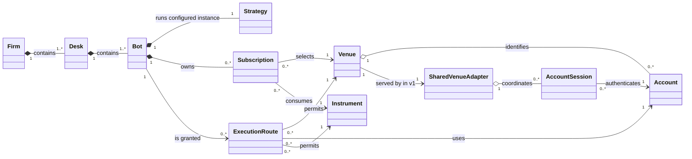

# Components and Domain Ownership

> **Purpose:** Assign each logical responsibility and mutable-state boundary to an architectural
> owner without prematurely fixing C++ class, process or deployment structure.

This document expands the [architecture overview](../architecture.md). It describes logical responsibilities and state ownership, not final C++ classes, APIs, object layouts, processes or deployment units.

## Status Legend

The table defines the status words used below so implemented, accepted, proposed, illustrative, and
unresolved work are never conflated.

| Label | Meaning |
|---|---|
| **Accepted** | An adopted architectural decision that constrains implementation. |
| **Proposed** | A current design candidate that still requires a later decision. |
| **Illustrative** | A conceptual aid whose names and relationships are not normative APIs or schemas. |
| **Open** | An intentionally unresolved design question. |

## Logical Component View

**Status:** The plane boundary, serialized ownership, and M2 ingress/market/dispatch/bot boundaries
are **Accepted and implemented**. M3 route, fixed-risk, outbound OMS, and fake-initiation contracts
are **Accepted and integrated** through [PR #10](https://github.com/KomodorDev/project-AEGIS/pull/10)
at `dev` merge commit `962eb8602c13c1930a74c59232f96920482edb2b`. The diagram is
**Illustrative** and does not imply queues, processes, or thread hops. ADR-0010 through ADR-0013
accept the M4 private-event, inventory, account-safety, fake-recovery, capacity, and evidence
contracts. The current baseline integrates the M4 policy/identity, normalized-ingress,
first-admission resolution, owner-bound correlation, fake-recovery authority, provenance, and typed
semantic-evidence foundations; it does not yet claim the complete inventory, reservation-conversion,
reconciliation, crash-matrix, or canonical-byte gate.

```mermaid
flowchart LR
    EX["Binance and Deribit"]

    subgraph DP["Data plane — one dedicated thread and serialized executor"]
        direction LR

        INGRESS["Bounded ingress<br/>admission, queue age and source fences"]
        SESSION["Venue and account sessions"]
        ADAPTER["Shared venue adapters<br/>parse, normalize and encode"]
        MARKET["Transactional market-data core<br/>four-state validity"]
        DISPATCH["Subscription dispatcher"]
        BOT["Bot runtime and strategy"]
        ROUTES["Execution-route authorization"]
        CANONICAL["Canonical economics and local identity"]
        SNAPSHOT["Owner-installed risk snapshot"]
        GUARD["Inline pre-trade risk guard<br/>installed snapshot and reservations"]
        OMS["Order management system<br/>M3 outbound admission; later reconciliation"]
        FAKE["Deterministic fake encoder and initiator<br/>structurally offline"]
        INVENTORY["Immediate inventory and exposure"]

        SESSION -->|"Native messages"| INGRESS
        INGRESS -->|"Serialized owner turn"| ADAPTER
        ADAPTER -->|"Normalized market event"| MARKET
        MARKET --> DISPATCH
        DISPATCH -->|"Synchronous callback"| BOT

        BOT -->|"submit bounded-field OrderRequest by const reference"| ROUTES
        ROUTES -->|"Authorized route projection"| CANONICAL
        ROUTES -->|"Local rejection"| BOT
        CANONICAL -->|"Validated request and generated identity"| GUARD
        CANONICAL -->|"Local rejection"| BOT
        SNAPSHOT -->|"Coherent installed policy"| GUARD
        GUARD -->|"Approved request and reservation"| OMS
        GUARD -->|"Local risk rejection"| BOT

        OMS -->|"M3 admitted order"| FAKE
        OMS -->|"Later native order"| ADAPTER
        ADAPTER -->|"Exchange-native order"| SESSION

        ADAPTER -->|"Normalized acknowledgement, rejection or fill"| OMS
        OMS -->|"Reconcile before publishing"| INVENTORY
        OMS -->|"Reservation transition"| GUARD
        OMS -->|"Normalized order event"| BOT
        INVENTORY -->|"Current positions and exposure"| GUARD
    end

    subgraph CP["Control plane — outside the latency-sensitive path"]
        direction TB

        AGGREGATION["Firm, desk and bot aggregation"]
        COORDINATOR["Risk coordinator<br/>budget and mode authority"]
        CONFIGURATION["Configuration authority<br/>adoption mechanism open"]
        UI["Risk UI and monitoring"]

        AGGREGATION --> COORDINATOR
        AGGREGATION --> UI
        COORDINATOR -->|"Status"| UI
        UI -->|"Operator commands"| COORDINATOR
    end

    EX -->|"Market data and order events"| SESSION
    SESSION -->|"Initiate asynchronous socket write"| EX

    INVENTORY -. "Asynchronous position and exposure observations" .-> AGGREGATION
    OMS -. "Asynchronous order and reservation observations" .-> AGGREGATION
    COORDINATOR -. "Complete immutable snapshot with monotonic revision" .-> SNAPSHOT
    CONFIGURATION -. "Immutable route update for owner adoption; protocol open" .-> ROUTES
```

Arrows show logical flow or dependency, not elapsed time. The distinction between synchronous calls and asynchronous events is defined in [Runtime Flows](runtime-flows.md).

M2 implements the credential-free path from recorded fixture ingress through the bot runtime and
strategy. The integrated M3 slice adds only owner-local route authorization, fixed risk,
outbound OMS admission, exact fake encoding, and in-memory initiation. Venue/account sessions,
native adapters, sockets, inventory, private reconciliation, and real transmission remain later
milestones. The revision-specific proof is in the [M3 exit-evidence
record](../milestones/m3-exit-evidence.md).

The view preserves these invariants:

- One serialized executor on one dedicated thread owns all mutable v1 data-plane state.
- Bounded ingress coordinates immutable work and exposes loss; its synchronization state cannot
  expose or mutate books, bots, strategies, diagnostics or traces from a producer.
- There is no general-purpose queue, serialization boundary, remote call, or executor hop anywhere
  in the M3 capability/evidence → route → canonical validation → identity → risk/reservation → OMS
  → exact encoding → fake-initiation path.
- A request cannot reach a venue session without route authorization, risk admission and OMS admission.
- Exchange acknowledgements, rejections and fills pass through OMS reconciliation before inventory or bot-facing order events are updated.
- Reservation transitions and immediate inventory changes complete on the data-plane owner before a later callback can make another risk decision.
- The control plane receives asynchronous observations and publishes immutable updates; it neither reads nor mutates live data-plane state concurrently.
- The UI has no dependency on the submission path.

## Conceptual Domain and Runtime Ownership

**Status:** Organizational relationships and configured M2 bot-runtime ownership are **Accepted and
implemented**. The adapter/session topology is **Proposed**. The diagram is **Illustrative**:
composition marks conceptual lifecycle ownership, not C++ pointer or storage semantics.

A `Subscription` selects one venue/instrument pair. An `ExecutionRoute` grants one venue/account/instrument combination. These are distinct: consuming an instrument does not grant permission to trade it.

The startup configuration contains one or more independent `Firm` roots. Every desk belongs to one
firm and every bot belongs to one desk; M1 introduces no parent-company object or cross-firm
aggregation.

Each bot owns a configured runtime instance of a reusable strategy implementation. Reuse describes the strategy design; it does not mean that mutable strategy state is shared between bots. The authoritative registration for `BotId` determines its desk and firm; strategy code cannot change that identity.

`SharedVenueAdapter` represents venue-wide protocol infrastructure used by all authorized bots. `AccountSession` represents authenticated private connectivity associated with one venue account. The number and specialization of sessions per account remain **Open**.
The configured account is a logical alias; an adapter-reported venue account identity is a distinct
value whose explicit reconciliation mapping begins in M7.

| Concept | Responsibility |
|---|---|
| Firm | One root of organizational attribution and aggregate firm risk, inventory and P&L. |
| Desk | Groups bots and carries desk-level attribution and allocated risk capacity. |
| Bot | A configured runtime strategy instance with immutable organizational identity. |
| Strategy | Reusable, venue-agnostic decision logic invoked through normalized events and capabilities. |
| Subscription | Declares normalized market data a bot consumes. |
| ExecutionRoute | Grants permission to trade one venue/account/instrument combination. |
| Venue | Identifies an exchange and its native protocol boundary. |
| Account | Identifies the logical configuration alias for venue-specific authenticated trading authority. |
| Instrument | Identifies the normalized instrument used by subscriptions, orders and attribution. |
| SharedVenueAdapter | Translates between native venue messages and exchange-neutral AEGIS types. |
| AccountSession | Maintains authenticated private connectivity and initiates asynchronous writes. |

## Mutable State Ownership

“Owner” means the only execution context permitted to mutate the state. Authoritative control-plane state and its installed data-plane copy are separate objects, not shared mutable memory.

| State | v1 owner | Update and observation rule |
|---|---|---|
| Venue connection, protocol and parser state | Data-plane executor | Updated only by serialized venue handlers; telemetry is reported asynchronously. |
| Normalized market state and subscription dispatch | Data-plane executor | A complete scratch candidate commits before `Ready` dispatch; non-ready transitions expose no book view. |
| Bot and mutable strategy runtime state | Data-plane executor | Mutated only during serialized bot callbacks. |
| Active subscription and route-authorization view | Data-plane executor | Implemented M3 behavior installs the sealed startup routes once in canonical order and reads them inline. Dynamic route adoption is deferred. |
| OMS order lifecycle and reconciliation state | Data-plane executor | Implemented M3 behavior admits outbound local identities and records local initiation or uncertainty. ADR-0010 requires every live/replayed/reconciled M4 private fact to pass through one idempotent OMS plan before economic mutation. |
| Reservations and open-order exposure | Data-plane executor | Implemented M3 check-and-reserve is atomic. ADR-0011 requires cumulative fills to convert residual reservation into confirmed exposure atomically; only definitive terminal venue facts or ADR-0012 complete proof release the remainder. |
| Immediate bot positions, inventory and exposure used by risk | Data-plane executor | ADR-0011 assigns one owner-local inventory ledger as confirmed-position truth across all seven firm-qualified scopes. Execution price is evidence only; P&L, fees and settlement remain M12. |
| Authoritative firm, desk and bot budgets and modes | Control-plane risk coordinator | Derived from aggregate observations and published as complete immutable snapshots. |
| Installed risk budget/mode snapshot | Data-plane executor through the inline guard | Implemented M3 behavior installs one complete immutable startup policy. M5 may replace it only between callbacks with a newer complete revision; partial installation is forbidden. |
| Aggregate reporting projections and UI view models | Control plane | Built from asynchronous observations and never consulted synchronously to approve an order. |
| Recovery journal/snapshot protocol and fake media | Data-plane executor publishes; bounded external-lifetime fake media retains acknowledged values | ADR-0012 fixes causal publication, contiguous fake durability, snapshot cuts, replay, authoritative reconciliation, and safe convergence. Real durable storage, retention and venue-backed recovery remain M9. |
| M4 capacity policy and canonical evidence | Sealed startup policy and owner-local bounded recorders | ADR-0013 fixes one immutable fingerprinted capacity policy and semantic M4 records without changing M1-M3 canonical bytes; required ADR-0014 precedes their byte encoders. |

The single-owner model removes concurrent mutation inside the v1 data plane. It does not make control-plane reporting synchronous, and it does not require control-plane state to share the data-plane thread. The full decision and its trade-offs are recorded in [ADR-0001](../decisions/0001-serialized-data-plane-execution.md).
