# Components and Domain Ownership

This document expands the [architecture overview](../architecture.md). It describes logical responsibilities and state ownership, not final C++ classes, APIs, object layouts, processes or deployment units.

## Status Legend

| Label | Meaning |
|---|---|
| **Accepted** | An adopted architectural decision that constrains implementation. |
| **Proposed** | A current design candidate that still requires a later decision. |
| **Illustrative** | A conceptual aid whose names and relationships are not normative APIs or schemas. |
| **Open** | An intentionally unresolved design question. |

## Logical Component View

**Status:** The plane boundary, serialized data-plane ownership and mandatory order path are **Accepted**. Component names and exact internal boundaries are **Proposed**. The diagram is **Illustrative** and does not imply queues, processes or thread hops.

```mermaid
flowchart LR
    EX["Binance and Deribit"]

    subgraph DP["Data plane — one dedicated thread and serialized executor"]
        direction LR

        SESSION["Venue and account sessions"]
        ADAPTER["Shared venue adapters<br/>parse, normalize and encode"]
        MARKET["Normalized market-data core"]
        DISPATCH["Subscription dispatcher"]
        BOT["Bot runtime and strategy"]
        ROUTES["Execution-route authorization"]
        SNAPSHOT["Owner-installed risk snapshot"]
        GUARD["Inline pre-trade risk guard<br/>installed snapshot and reservations"]
        OMS["Order management system<br/>lifecycle and reconciliation"]
        INVENTORY["Immediate inventory and exposure"]

        SESSION -->|"Native messages"| ADAPTER
        ADAPTER -->|"Normalized market event"| MARKET
        MARKET --> DISPATCH
        DISPATCH -->|"Synchronous callback"| BOT

        BOT -->|"submit fixed-size OrderRequest"| ROUTES
        ROUTES -->|"Authorized request"| GUARD
        ROUTES -->|"Local rejection"| BOT
        SNAPSHOT -->|"Coherent installed policy"| GUARD
        GUARD -->|"Approved request and reservation"| OMS
        GUARD -->|"Local risk rejection"| BOT

        OMS -->|"Order to encode"| ADAPTER
        ADAPTER -->|"Exchange-native order"| SESSION

        ADAPTER -->|"Normalized acknowledgement, rejection or fill"| OMS
        OMS -->|"Reconcile before publishing"| INVENTORY
        OMS -->|"Reservation transition"| GUARD
        OMS -->|"Normalized order event"| BOT
        INVENTORY -->|"Current positions and exposure"| GUARD
    end

    subgraph CP["Control plane — outside the latency-sensitive path"]
        direction TB

        AGGREGATION["Firm, desk and bot aggregation"]
        COORDINATOR["Risk coordinator<br/>budget and mode authority"]
        CONFIGURATION["Configuration authority<br/>adoption mechanism open"]
        UI["Risk UI and monitoring"]

        AGGREGATION --> COORDINATOR
        AGGREGATION --> UI
        COORDINATOR -->|"Status"| UI
        UI -->|"Operator commands"| COORDINATOR
    end

    EX -->|"Market data and order events"| SESSION
    SESSION -->|"Initiate asynchronous socket write"| EX

    INVENTORY -. "Asynchronous position and exposure observations" .-> AGGREGATION
    OMS -. "Asynchronous order and reservation observations" .-> AGGREGATION
    COORDINATOR -. "Complete immutable snapshot with monotonic revision" .-> SNAPSHOT
    CONFIGURATION -. "Immutable route update for owner adoption; protocol open" .-> ROUTES
```

Arrows show logical flow or dependency, not elapsed time. The distinction between synchronous calls and asynchronous events is defined in [Runtime Flows](runtime-flows.md).

The view preserves these invariants:

- One serialized executor on one dedicated thread owns all mutable v1 data-plane state.
- There is no general-purpose queue, serialization boundary, remote call or executor hop between strategy submission and the inline risk decision.
- A request cannot reach a venue session without route authorization, risk admission and OMS admission.
- Exchange acknowledgements, rejections and fills pass through OMS reconciliation before inventory or bot-facing order events are updated.
- Reservation transitions and immediate inventory changes complete on the data-plane owner before a later callback can make another risk decision.
- The control plane receives asynchronous observations and publishes immutable updates; it neither reads nor mutates live data-plane state concurrently.
- The UI has no dependency on the submission path.

## Conceptual Domain and Runtime Ownership

**Status:** Organizational and bot relationships are **Accepted**. The adapter/session topology is **Proposed**. The diagram is **Illustrative**: composition marks conceptual lifecycle ownership, not C++ pointer or storage semantics.

A `Subscription` selects one venue/instrument pair. An `ExecutionRoute` grants one venue/account/instrument combination. These are distinct: consuming an instrument does not grant permission to trade it.

Each bot owns a configured runtime instance of a reusable strategy implementation. Reuse describes the strategy design; it does not mean that mutable strategy state is shared between bots. The authoritative registration for `BotId` determines its desk and firm; strategy code cannot change that identity.

`SharedVenueAdapter` represents venue-wide protocol infrastructure used by all authorized bots. `AccountSession` represents authenticated private connectivity associated with one venue account. The number and specialization of sessions per account remain **Open**.

| Concept | Responsibility |
|---|---|
| Firm | Root of organizational attribution and aggregate firm risk, inventory and P&L. |
| Desk | Groups bots and carries desk-level attribution and allocated risk capacity. |
| Bot | A configured runtime strategy instance with immutable organizational identity. |
| Strategy | Reusable, venue-agnostic decision logic invoked through normalized events and capabilities. |
| Subscription | Declares normalized market data a bot consumes. |
| ExecutionRoute | Grants permission to trade one venue/account/instrument combination. |
| Venue | Identifies an exchange and its native protocol boundary. |
| Account | Identifies venue-specific authenticated trading authority. |
| Instrument | Identifies the normalized instrument used by subscriptions, orders and attribution. |
| SharedVenueAdapter | Translates between native venue messages and exchange-neutral AEGIS types. |
| AccountSession | Maintains authenticated private connectivity and initiates asynchronous writes. |

## Mutable State Ownership

“Owner” means the only execution context permitted to mutate the state. Authoritative control-plane state and its installed data-plane copy are separate objects, not shared mutable memory.

| State | v1 owner | Update and observation rule |
|---|---|---|
| Venue connection, protocol and parser state | Data-plane executor | Updated only by serialized venue handlers; telemetry is reported asynchronously. |
| Normalized market state and subscription dispatch | Data-plane executor | Updated and dispatched within run-to-completion callbacks. |
| Bot and mutable strategy runtime state | Data-plane executor | Mutated only during serialized bot callbacks. |
| Active subscription and route-authorization view | Data-plane executor | The installed runtime view is read inline; the configuration source and adoption protocol remain **Open**. |
| OMS order lifecycle and reconciliation state | Data-plane executor | All submissions and exchange order events pass through the OMS on the same owner. |
| Reservations and open-order exposure | Data-plane executor | Check-and-reserve and later transitions are serialized with OMS and inventory changes. |
| Immediate bot positions, inventory and exposure used by risk | Data-plane executor | Exchange events update this state before any later callback or risk decision runs. P&L calculation placement remains **Open**. |
| Authoritative firm, desk and bot budgets and modes | Control-plane risk coordinator | Derived from aggregate observations and published as complete immutable snapshots. |
| Installed risk budget/mode snapshot | Data-plane executor through the inline guard | A newer monotonic revision replaces the previous snapshot between callbacks; partial installation is forbidden. |
| Aggregate reporting projections and UI view models | Control plane | Built from asynchronous observations and never consulted synchronously to approve an order. |
| Durable audit, recovery and persistence state | **Open** | Ownership and reconciliation rules require a later decision. |

The single-owner model removes concurrent mutation inside the v1 data plane. It does not make control-plane reporting synchronous, and it does not require control-plane state to share the data-plane thread. The full decision and its trade-offs are recorded in [ADR-0001](../decisions/0001-serialized-data-plane-execution.md).
