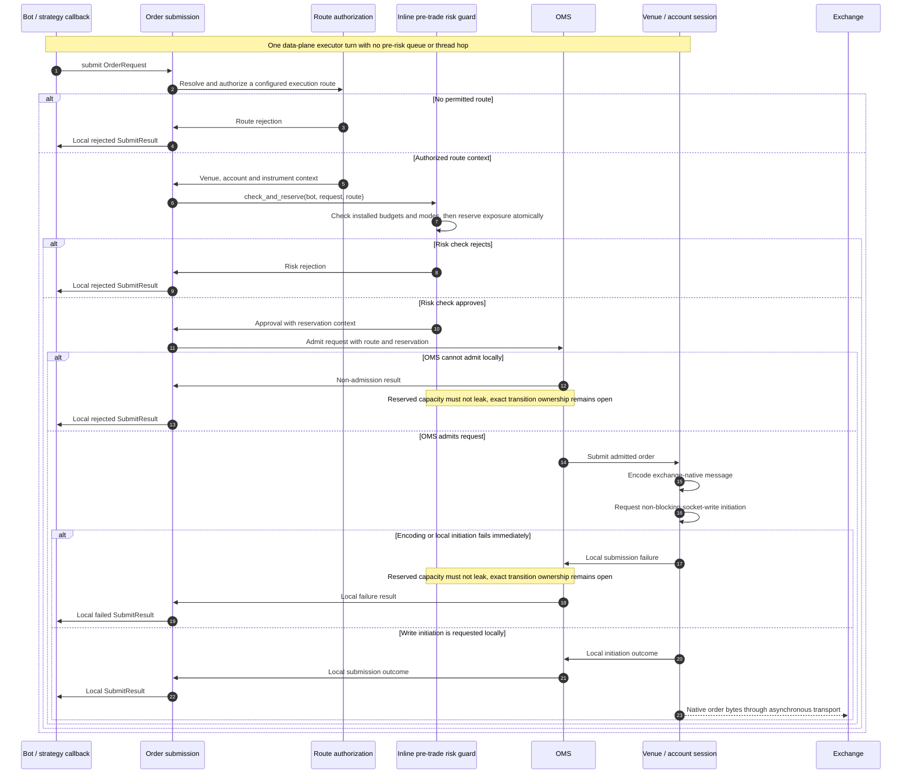
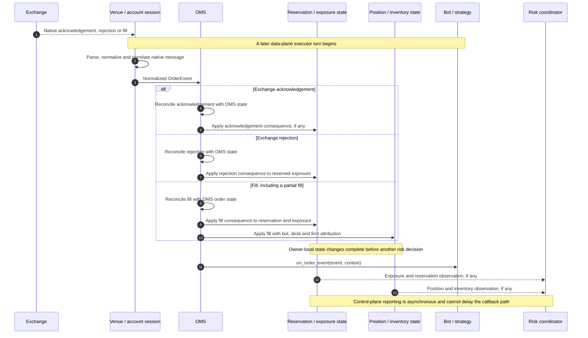
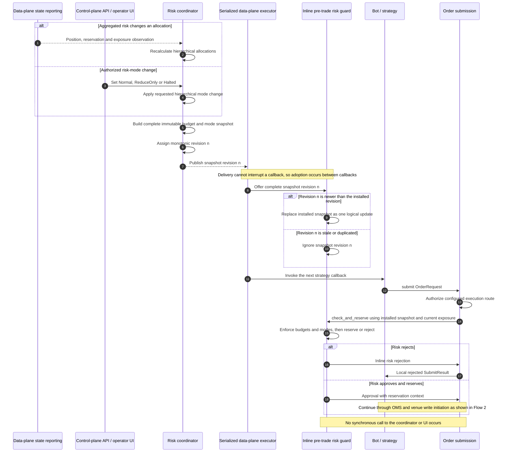

# Runtime Flows

> **Purpose:** Show how accepted serialized ownership, M2 market validity, and later order/risk
> boundaries sequence complete work without implying hidden thread hops or partial state.

**Status: Accepted invariants with illustrative participants.** M2 fixes the ingress and market-state
branches; order, risk, private-session, and recovery details remain proposed or open.

Return to the [architecture overview](../architecture.md) or read
[ADR-0001](../decisions/0001-serialized-data-plane-execution.md),
[ADR-0006](../decisions/0006-bounded-deterministic-runtime.md), and
[ADR-0007](../decisions/0007-market-state-validity.md).

- Solid arrows (`->>`) represent interactions completed in the current execution context. Within the data plane, they run on the single serialized executor without an intervening general-purpose queue or thread hop.
- Dashed arrows (`-->>`) represent asynchronous transport, a later executor turn or off-path control-plane delivery.
- Participant and message names are illustrative rather than final C++ interfaces.
- Ordering and ownership boundaries are architectural constraints.

## 1. Market-Data Delivery

M2 drives this flow from a credential-free recorded source. M6 may later place a public venue adapter
behind the same bounded admission and normalized-update boundary. Native exchange subscription is
always separate from the internal bot grants matched below.

```mermaid
sequenceDiagram
    autonumber
    participant F as Recorded fixture source
    participant E as Bounded serialized executor
    participant P as Strict fixture parser
    participant M as Owner-local market state
    participant D as Subscription dispatcher
    participant B as Bot / strategy

    F->>E: try_admit owned bounded frame

    alt Ingress capacity is exhausted
        E->>F: CapacityExceeded with attempt ordinal and capacity
        alt Attempt names a registered source
            E-->>M: Ordered source-discontinuity fence on an owner turn
            M->>D: Invalid state transition, snapshot required
        else Attempt is unattributable or unconfigured
            Note over F,E: Caller must stop or resynchronize; no arbitrary source is mutated
        end
    else Admission succeeds
        E->>F: Receipt with receive sequence, timestamp and queue depth
        Note over E,B: One bounded, non-reentrant owner turn begins
        E->>P: Parse and normalize temporary value

        alt Frame is malformed or unsupported
            P->>M: Stable failure with source attribution, no MarketEvent
            M->>D: Invalid state transition when active source integrity may be lost
        else Frame is valid
            P->>M: Complete NormalizedMarketUpdate
            M->>M: Validate full scratch candidate and reserve critical traces

            alt Update is invalid, stale or discontinuous
                M->>D: Sanitized non-ready state transition only
                D->>B: on_market_state(state_event, context)
            else Complete commit is Ready
                M->>M: Swap candidate and advance generation/revision
                M->>D: Immutable MarketEvent and ReadyBookView
                D->>D: Match grants in canonical SubscriptionId order

                loop Each matching subscription
                    opt Commit changes state to Ready
                        D->>B: on_market_state(ready_event, context)
                    end
                    D->>B: on_market_data(event, ready_view, context)
                    Note right of B: Callback runs to completion and cannot block or re-enter
                end
            end
        end
    end
```

State transitions use a separate `on_market_state` callback and never carry a tradable book. M2's
`BotContext` has no order capability. M3 will add the submission boundary shown in Flow 2 without
adding an executor hop inside a callback.

## 2. Order Submission



The exact successful `SubmitResult` states and timing remain open; no local result is an exchange acknowledgement. A bounded session-local write sequencer may eventually be required after OMS admission, but its admission, capacity and overload semantics remain open. It must not become a pre-risk service queue.

Route authorization is mandatory, but whether an `OrderRequest` names a route or another configuration-owned mechanism resolves its account remains open. The precise reservation transitions on OMS non-admission and local transport failure also remain open; the invariant is that reserved capacity cannot be silently leaked.

## 3. Acknowledgements, Rejections and Fills



Every private order or execution event shown here passes through OMS reconciliation. A fill cannot update a reporting ledger while bypassing OMS or the immediate position state used by subsequent risk decisions. The exact OMS states and reservation effects for acknowledgements, rejections, partial fills, cancellations and out-of-order exchange events remain open.

## 4. Risk Snapshot Publication and Enforcement



Snapshots are complete so a callback never observes a partially updated budget or mode hierarchy. Monotonic revisions prevent delayed control-plane delivery from reinstalling older authority.

## Cross-Flow Invariants

- One dedicated thread and serialized executor owns all mutable v1 data-plane state shown here.
- Data-plane handlers run to completion, remain non-blocking and are non-reentrant.
- Bounded ingress exposes admission outcome, capacity and queue age; rejected attributable market
  input creates an ordered discontinuity fence before later source work.
- Market updates commit completely before canonical subscription dispatch; only `Ready` callbacks
  receive a book view.
- Strategy submission, route authorization, risk check and reservation, OMS admission, native encoding and the write-initiation request remain one direct executor-local path.
- The OMS cannot be bypassed by outbound orders or inbound private-order events.
- Fill-driven position and exposure changes are visible before a bot receives the fill event or can make another risk decision.
- Control-plane aggregation, monitoring and UI work never blocks the latency-sensitive path.
- Exchange acknowledgements, rejections, fills and socket completions occur on later executor turns.

## Open Items

- Execution-route identity and account-selection interface.
- Detailed OMS states, identifiers, correlation rules and event-order handling.
- Reservation transitions for every acknowledgement, rejection, partial fill, cancellation, timeout and local failure.
- Exact hierarchical semantics of `ReduceOnly` and `Halted`, including existing-order cancellation and budget reductions below current exposure.
- Session write sequencing, outbound overload policy and cross-plane reporting backpressure.
- Reconnect, recovery, exchange reconciliation and persistence behavior.
- Asynchronous-I/O and public venue networking libraries.

Reconnect and reconciliation sequences are intentionally deferred until the OMS state model and recovery policy are decided.
