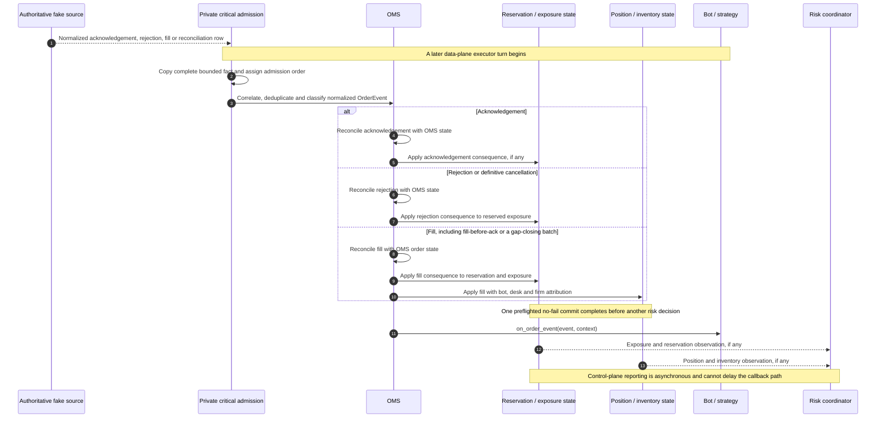

# Runtime Flows

> **Purpose:** Show how accepted serialized ownership, M2 market validity, and M3 submission
> boundaries sequence complete work without implying hidden thread hops or partial state.

**Status: Implemented and integrated M2 market flow and M3 local-submission flow.** M2
implements the recorded ingress, serialized owner, validity, exact preflight, callback, diagnostic,
and replay branches. ADR-0008 and ADR-0009 accept the M3 route, fixed-risk, outbound OMS, and
deterministic fake boundaries. [PR #10](https://github.com/KomodorDev/project-AEGIS/pull/10)
integrated Flow 2 into `dev` as merge commit `962eb8602c13c1930a74c59232f96920482edb2b`. Private sessions,
exchange events, dynamic risk, and recovery remain later work.

Return to the [architecture overview](../architecture.md) or read
[ADR-0001](../decisions/0001-serialized-data-plane-execution.md),
[ADR-0006](../decisions/0006-bounded-deterministic-runtime.md), and
[ADR-0007](../decisions/0007-market-state-validity.md),
[ADR-0008](../decisions/0008-canonical-submission-and-fixed-risk.md), and
[ADR-0009](../decisions/0009-outbound-oms-and-fake-initiation.md).

- Solid arrows (`->>`) represent interactions completed in the current execution context. Within the data plane, they run on the single serialized executor without an intervening general-purpose queue or thread hop.
- Dashed arrows (`-->>`) represent asynchronous transport, a later executor turn or off-path control-plane delivery.
- Participant and message names are illustrative rather than final C++ interfaces.
- Ordering and ownership boundaries are architectural constraints.

## 1. Market-Data Delivery

M2 drives this flow from a credential-free recorded source. M6 may later place a public venue adapter
behind the same bounded admission and normalized-update boundary. Native exchange subscription is
always separate from the internal bot grants matched below.

```mermaid
sequenceDiagram
    autonumber
    participant F as Recorded fixture source
    participant E as Bounded serialized executor
    participant P as Strict fixture parser
    participant M as Owner-local market state
    participant D as Subscription dispatcher
    participant B as Bot / strategy

    F->>E: try_admit owned bounded frame

    alt Ingress capacity is exhausted
        E->>F: CapacityExceeded with attempt ordinal and capacity
        alt Attempt names a registered source
            E-->>M: Ordered source-discontinuity fence on an owner turn
            M->>D: Invalid state transition, snapshot required
        else Attempt is unattributable or unconfigured
            Note over F,E: Caller must stop or resynchronize; no arbitrary source is mutated
        end
    else Admission succeeds
        E->>F: Receipt with receive sequence, timestamp and queue depth
        Note over E,B: One bounded, non-reentrant owner turn begins
        E->>P: Parse and normalize temporary value

        alt Frame is malformed or unsupported
            P->>M: Stable failure with source attribution, no MarketEvent
            M->>D: Invalid state transition when active source integrity may be lost
        else Frame is valid
            P->>M: Complete NormalizedMarketUpdate
            M->>M: Classify full scratch candidate and preflight exact traces/callbacks

            alt Update is invalid, stale or discontinuous
                M->>D: Sanitized non-ready state transition only
                D->>B: on_market_state(state_event, context)
            else Complete commit is Ready
                M->>M: Swap candidate and advance generation/revision
                M->>D: Immutable MarketEvent and ReadyBookView
                D->>D: Match grants in canonical SubscriptionId order

                loop Each matching subscription
                    opt Commit changes state to Ready
                        D->>B: on_market_state(ready_event, context)
                    end
                    D->>B: on_market_data(event, ready_view, context)
                    Note right of B: Callback runs to completion and cannot block or re-enter
                end
            end
        end
    end
```

State transitions use a separate `on_market_state` callback and never carry a tradable book. The M2
observation-only composition installs no submission authority. The integrated M3
composition adds only the bot-bound fake submission boundary shown in Flow 2, without adding an
executor hop inside a callback.

`MarketRuntime` composes this flow without a producer-side mutation path. Both the manual and
dedicated drivers invoke the same turn processor; the M2 reference scenario proves that their copied
callback vectors, structured diagnostics, `AEGISRTS` records, canonical bytes, and digest agree
exactly.

## 2. Order Submission — Integrated M3

The M3 feature branch published as
[PR #10](https://github.com/KomodorDev/project-AEGIS/pull/10) implements this complete direct flow
and was merged unchanged into `dev` as `962eb8602c13c1930a74c59232f96920482edb2b`.
The [M3 exit-evidence record](../milestones/m3-exit-evidence.md) pins the ordinary result matrix,
exact traces, retained state, and same-turn proof. No M3 submission component or repository fixture
in this flow has live communication capability.

```mermaid
sequenceDiagram
    autonumber
    participant B as Bot / strategy callback
    participant S as Order submission
    participant A as Route authorization
    participant G as Inline pre-trade risk guard
    participant O as OMS
    participant C as Exact fake encoder
    participant F as In-memory fake initiator

    Note over B,F: One data-plane owner turn; no queue, coroutine, remote call or thread hop
    B->>S: submit limit/GTC OrderRequest with RouteId
    S->>S: Validate active callback and preflight AEGISSTS evidence
    S->>A: Resolve owner-local route for context BotId

    alt No permitted route
        A->>S: Stable route rejection, no OrderId or reservation
        S->>B: LocallyRejected
    else Authorized route context
        A->>S: Venue, account and instrument context
        S->>S: Validate exact vocabulary, price, quantity and inverse economics
        S->>S: Generate collision-safe local OrderId
        S->>G: check_and_reserve attribution, request, route and policy
        G->>G: Check seven scopes in scratch, then commit atomically

        alt Risk check rejects
            G->>S: Stable risk rejection, no reservation
            S->>B: LocallyRejected
        else Risk check approves
            G->>S: Approval with held ReservationId
            S->>O: Admit request with route and reservation

            alt OMS cannot admit locally
                O->>S: Non-admission result
                S->>G: Release reservation exactly once
                S->>B: LocallyRejected
            else OMS admits request
                S->>C: Encode only the OMS-admitted order

                alt Encoding fails
                    C->>S: Scripted EncodingFailed outcome
                    S->>O: Mark LocallyFailed
                    S->>G: Release reservation exactly once
                    S->>B: LocallyRejected
                else Exact AEGISFOE bytes
                    C->>S: Exact AEGISFOE bytes
                    S->>O: Mark PendingInitiation
                    S->>F: Initiate deterministic in-memory write analogue

                    alt Failure before accepted-slot copy
                        F->>S: Definite pre-acceptance outcome
                        S->>O: Mark LocallyFailed
                        S->>G: Release reservation exactly once
                        S->>B: LocallyRejected
                    else Bytes copied and initiation succeeds
                        F->>S: Accepted-and-initiated outcome
                        S->>O: Mark WriteInitiated
                        Note over G,O: Reservation remains held; this is not an acknowledgement
                        S->>B: WriteInitiated
                    else Bytes copied and local outcome is lost
                        F->>S: Accepted-then-outcome-lost
                        S->>O: Mark SubmissionUnknown
                        Note over G,O: Retain exposure; reconciliation required; never auto-retry
                        S->>B: SubmissionUnknown
                    end
                end
            end
        end
    end
```

`WriteInitiated` ends at successful local fake initiation and is never an exchange acknowledgement.
The accepted-slot copy is the only M3 boundary after which acceptance may have occurred. M3 contains
no socket, endpoint, credential, private session, or exchange participant. A bounded real
session-local write sequencer and its overload policy remain M8 work and cannot become a pre-risk
service queue.

## 3. Private-Order Reconciliation — Accepted M4 Contract



This flow is not implemented by M3. ADR-0010 accepts the exact M4 normalized event, correlation,
deduplication, out-of-order fill, OMS, cancellation, and callback rules. ADR-0011 accepts the joint
OMS/reservation/inventory plan and all seven scope aggregates. ADR-0012 requires live, replayed and
authoritative order/execution facts to use this same path and dispatches non-order recovery records
through closed typed restore planners. ADR-0013 fixes admission headroom and canonical evidence. No
timeout, disconnect, cancel request, cancel-write result, incomplete snapshot, or open-order absence
releases exposure.

## 4. Risk Snapshot Publication and Enforcement — M5 and Later

```mermaid
sequenceDiagram
    autonumber
    participant D as Data-plane state reporting
    participant U as Control-plane API / operator UI
    participant C as Risk coordinator
    participant E as Serialized data-plane executor
    participant G as Inline pre-trade risk guard
    participant B as Bot / strategy
    participant S as Order submission

    alt Aggregated risk changes an allocation
        D-->>C: Position, reservation and exposure observation
        C->>C: Recalculate hierarchical allocations
    else Authorized risk-mode change
        U->>C: Set Normal, ReduceOnly or Halted
        C->>C: Apply requested hierarchical mode change
    end

    C->>C: Build complete immutable budget and mode snapshot
    C->>C: Assign monotonic revision n
    C-->>E: Publish snapshot revision n

    Note over E,G: Delivery cannot interrupt a callback, so adoption occurs between callbacks
    E->>G: Offer complete snapshot revision n

    alt Revision n is newer than the installed revision
        G->>G: Replace installed snapshot as one logical update
    else Revision n is stale or duplicated
        G->>G: Ignore snapshot revision n
    end

    E->>B: Invoke the next strategy callback
    B->>S: submit OrderRequest
    S->>S: Authorize configured execution route
    S->>S: Validate exact canonical economics
    S->>S: Generate collision-safe local OrderId
    S->>G: check_and_reserve using installed snapshot and current exposure
    G->>G: Enforce budgets and modes, then reserve or reject

    alt Risk rejects
        G->>S: Inline risk rejection
        S->>B: Local rejected SubmitResult
    else Risk approves and reserves
        G->>S: Approval with reservation context
        Note over B,S: M3 continues through OMS and fake initiation; native venue initiation is M8
    end
    Note over S,G: No synchronous call to the coordinator or UI occurs
```

M3 implements only one complete immutable startup snapshot and does not execute this dynamic
publication flow. M5 must preserve the complete-snapshot and monotonic-adoption rules shown here so
a callback never observes a partial or older authority.

## Cross-Flow Invariants

- One dedicated thread and serialized executor owns all mutable v1 data-plane state shown here.
- Data-plane handlers run to completion, remain non-blocking and are non-reentrant.
- Bounded ingress exposes admission outcome, capacity and queue age; rejected attributable market
  input creates an ordered discontinuity fence before later source work.
- Market updates commit completely before canonical subscription dispatch; only `Ready` callbacks
  receive a book view.
- Capability/evidence checks, route authorization, canonical validation, identity generation, risk
  check/reservation, OMS admission, exact fake encoding, and fake write initiation remain one direct
  executor-local path in M3. Native encoding and real initiation remain M8.
- The OMS cannot be bypassed by outbound orders or inbound private-order events.
- Fill-driven position and exposure changes are visible before a bot receives the fill event or can make another risk decision.
- Control-plane aggregation, monitoring and UI work never blocks the latency-sensitive path.
- Exchange acknowledgements, rejections, fills and socket completions occur on later executor turns.

## Later-Milestone Open Items

- Exact hierarchical semantics of `ReduceOnly` and `Halted`, including existing-order cancellation and budget reductions below current exposure.
- Session write sequencing, outbound overload policy and cross-plane reporting backpressure.
- Native authenticated reconnect/query/stream mechanics and durable persistence implementation.
- Asynchronous-I/O and public venue networking libraries.

ADR-0012 fixes the venue-neutral recovery sequence, including acknowledged namespace registration,
typed replay, one closed catch-up fence, and safe convergence. M7 must prove a native authoritative-
completeness mechanism; M9 must implement the accepted journal/snapshot protocol durably.
